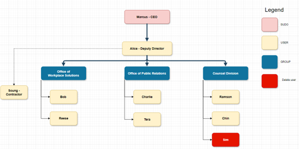
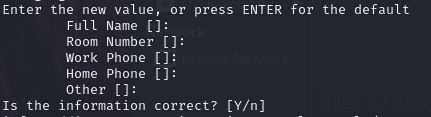

# Kali-User-Management-Project
Learn how to create, update, and delete users and groups for Linux distribution! 

---

## 🚀 Features
- **Step-by-Step Instructions**: Learn how to manage users and groups in Kali Linux.
- **Hands-On Exercise**: Replicate an organizational chart to test your skills.
- **Ready-to-Use Commands**: Copy and paste commands to get started quickly.

---

## 📋 Table of Contents
1. [Introduction](#Introduction)
2. [Prerequisites](#Prerequisites)
3. [Steps By Step Implementation](#StepsByStepImplementation)
4. [Conclusion](#Conclusion)
5. [What's Next?](#What’sNext?)
6. [Challenge (Optional)](#challenge)

---

## 🎯 Introduction
Managing users and groups is a fundamental skill for anyone working with Linux systems. Whether you're a system administrator or a Linux enthusiast, understanding how to create, update, and delete users and groups manually is essential. In this guide, we’ll walk you through the process step by step.

In Linux, every action is tied to a user or group. Proper user and group management ensures security, organization, and efficient system administration. This guide will teach you how to:
- **Create users and groups**.
- **Assign users to groups**.
- **Update user details**.
- **Delete users and groups**.
  
By the end of this guide, you’ll be able to manage users and groups confidently in Kali Linux.

---

## 🛠️ Prerequisites
- Kali Linux installed (or any Debian-based distribution).
- Root or Sudo access.
- Basic understanding of Linux commands and Linux terminal.

---

## 🚦 Steps By Step Implementation:
Breaking the project into clear, actionable steps:
In this project, we will leverage the following organizational chart as a reference to guide our User and Group management. This chart outlines the structure of users, groups, and their respective roles, ensuring a clear and systematic approach to user management in Kali Linux. 

<p align="center">
  
  <br>
  <em>Img1: Organization Chart</em>
</p>

### Step 1. Create Users
To be able to create a new user, we will need to use the "**adduser**" command. This command is an interactive way that will prompt you for additional details like the user’s full name and password. 

Example:
```bash
sudo adduser alice
```
Then follow the prompts to set the remaining details. Enter "**Y**" when you are ready to add in the user or else enter "**N**" to adjust the information:

<p align="center">
  
  <br>
  <em>Img2: User Details</em>
</p>

---

### Step 2. Create Groups
Groups allow you to manage permissions for multiple users at once. Use the “**groupadd**” command to create a new group.

Example:
```bash
sudo groupadd DeputyDirector
```

---

### Step 3. Adding Users into Groups
To add a user to a group, use the “**usermod**” command. The “**-aG**” flag ensures the user is added to the group without being removed from other groups.

Example: 
```bash
sudo usermod -aG DeputyDirector alice
```

---

### Step 4. Updating User Details
You can update a user’s details, such as their full name or home directory, using the “**usermod**” command. 

Change User’s Full Name:
```bash
sudo usermod -c "Alice Example" alice
```

Change User's Home Directory:
```bash
sudo usermod -d /home/aliceNewDirectory -m alice
```

---

### Step 5. Deleting Users
To delete a user, use the “**deluser**” command. The “**--remove-home**” flag ensures the user’s home directory is also deleted.

Example: 
```bash
sudo deluser --remove-home sim
```
---

### Step 6. Deleting Groups
To delete a group, use the “**groupdel**” command. Ensure no users are assigned to the group before deleting it.

Example:
```bash
sudo groupdel OfficeOfWorkplaceSolutions
```

---

### Step 7. Removing user from a group
To remove a user from a group, use the “**gpasswd**” command with “**--delete**” flag to remove a user from a group. 

Example:
```bash
sudo gpasswd --delete tera OfficeOfPublicRelations
```

---
### Step 8. Verifications
After performing user and group management tasks, verify the results.

**Check User Details:**
```bash
id marcus
```
Output:
```bash
uid=1001(marcus) gid=1001(marcus) groups=1001(marcus),27(sudo),100(users),1075(CEO)
```
**Check Group Details:**
```bash
getent group OfficeOfPublicRelations
```
Output:
```bash
OfficeOfPublicRelations:x:1010:charlie
```

---

### Common Issues and Troubleshooting
- **Permission Denied:**
  - Ensure that you are using **“sudo”** or have root access
- **User or Group Already Exists:**
  - Use **“id username”** or **“getent group GroupName”** to check if the user or group exists
- **Cannot Delete User:**
  - Ensure that the user is not logged in or running any active process.
- **Unsure what does the command does:**
  - Use the **“man command”** to display the user manual of the command. 

---

### 🏆 Conclusion
Congratulations! You’ve taken your first steps toward mastering user and group management in Kali Linux. By learning how to create, update, and delete users and groups manually, you’ve gained a foundational skill that’s essential for system administration, security, and efficient workflow management. 

---

### 📜 What’s Next?
Now that you’ve mastered the manual process, it’s time to take your skills to the next level! In Project 2, we’ll explore how to **automate user and group management using Bash scripts**. Imagine creating, updating, and deleting hundreds of users in minutes—sounds exciting, right?

---

### 🧩 Challenge (Optional): 
Now that you’ve learned how to manually create, update, and delete users and groups, it’s time to put your skills to the test! In this exercise, you’ll replicate the above organizational chart (Img1) in your choice of Linux system.

---

Once you’ve completed the exercise, share your experience in the comments! If you’re stuck, don’t hesitate to ask for help. And don’t forget to check out my next project, where we’ll automate this entire process!


